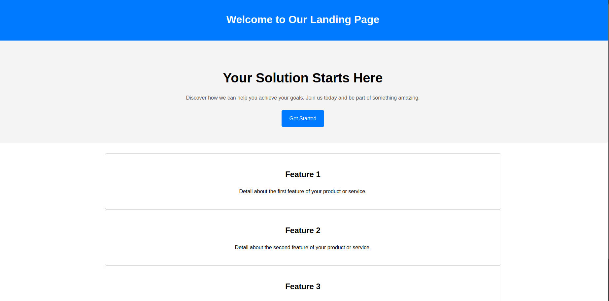

Landing Page Template

🚀 Overview
This repository contains a simple and responsive landing page template designed for various purposes, such as showcasing products, promoting services, or collecting leads. The page is clean, modern, and easy to customize.

✨ Features
Responsive Design: Looks great on desktops, tablets, and mobile devices.
Clean and Minimalist Layout: Focused on usability and user experience.
Customizable Code: Easily adapt the template to your needs.
Includes Key Sections: Hero section, features section, and footer.

📂 File Structure

project-folder/

├── index.html   # Main HTML file

├── styles.css   # CSS for the page

└── README.md    # Documentation

🛠️ How to Use
1. Clone the repository:

  git clone https://github.com/EdivaldoPereira/landingPage.git

2. Open the index.html file in your browser to view the page.
3. Edit the index.html and styles.css files to customize the content and design.

📷 Preview

